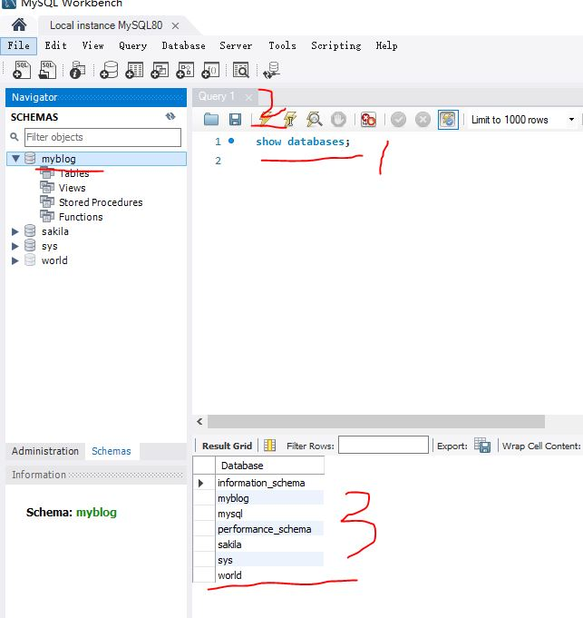

## 一、接口开发(原生版)

### 1. 开发路由
#### 1. 新建目录 

- 创建文件夹node-blog-server
- npm init -y初始化项目

#### 2. 搭建服务器

- 首先，修改package.json中的执行入口文件为：bin/www.js

- 搭建服务器(node版本低，没有使用es6)

  - www.js：服务器启动文件

    ```js
    const http = require('http')
    
      const serverHandle = require("../app")
      const PORT = 8000
      
      // 创建服务器
      const server = http.createServer(serverHandle)
      // 监听端口
      server.listen(PORT)
    ```

  - app.js: 服务器回调方法

    ```js
    // 服务器回调
      const serverHandle = (req, res) => {
          // 设置数据返回格式  json格式
          res.setHeader('Content-type', 'application/json')
      
          const resData = {
              name: "shasa",
              site: 'russia'
          }
      
          res.end(JSON.stringify(resData))
      }
      
      // 暴露方法
      module.exports = serverHandle
    ```

#### 3. 安装工具
1. nodemon :监听文件变化，自动重启node

2. cross-env ： 设置环境变量(开发、生产等环境)，兼容mac linux和windows
   ```js
   npm install nodemon cross-env --save-dev
   ```
   
3. 设置开发环境
   - package.json
   ```json
   "scripts": {
    "test": "echo \"Error: no test specified\" && exit 1",
    "dev": "cross-env NODE_ENV=dev nodemon ./bin/www.js",
    "prd": "cross-env NODE_ENV=production nodemon ./bin/www.js"
    },
   ```
   - 可以在服务器在返回的数据中获取环境
    ```js
    // 服务器回调
    const serverHandle = (req, res) => {
        // 设置数据返回格式  json格式
        res.setHeader('Content-type', 'application/json')
    
        const resData = {
            name: "shasa",
            site: 'russia',
            // 识别环境
            env:process.env.NODE_ENV
        }
    
        res.end(JSON.stringify(resData))
    }
    
    // 暴露方法
    module.exports = serverHandle
    ```
    - process.env: Nodejs提供的一个API,它返回一个包含用户环境信息的对象
        - process.env.NODE_ENV中的NODE_ENV是package.json中scripts中的变量

#### 4. 初始化路由

- 测试接口是否可用，get可以直接在浏览器输入接口地址，post用postman测试

##### 1. 接口设计
| 描述 | 接口 | 方法 | 参数 | 备注 |
| ------ | ------ | ------ | ------ | ------ |
| 博客列表 | /api/blog/list | get | author作者，keyword搜索关键字 | 参数若为空，不进行查询过滤 |
| 单篇博客详情 | /api/blog/detail | get |  id |  |
| 新增一篇博客 | /api/blog/new | post |  | post中有新增的消息 |
| 更新一篇博客 | /api/blog/update | post |  id | postData中有更新的内容 |
| 删除一篇博客 | /api/blog/del | post |  id |  |
| 登录 | /api/user/login | post |   | postData中有用户名和密码 |

##### 2. 初始化路由
- 新建src/router文件夹，blog.js(博客路由)，user.js(用户路由)
- blog.js
  ```js
  // 博客路由
  const handleBlogRouter = (req, res) => {
      const method = req.method // get post
      const url = req.url
      const path = url.split('?')[0]
  
      // 获取博客列表
      if(method === 'GET' && path === '/api/blog/list') {
          return {
              msg: '博客列表'
          }
      }
      // 获取博客详情
      if(method === 'GET' && path === '/api/blog/detail') {
          return {
              msg: '博客详情'
          }
      }
      // 新增博客
      if(method === 'POST' && path === '/api/blog/new') {
          return {
              msg: '新增博客'
          }
      }
      // 更新博客
      if(method === 'POST' && path === '/api/blog/update') {
          return {
              msg: '更新博客'
          }
      }
      // 删除博客
      if(method === 'POST' && path === '/api/blog/del') {
          return {
              msg: '删除博客'
          }
      }
  }
  
  module.exports = handleBlogRouter
  ```
- user.js
  ```js
  // 登录路由
  const handleUserRouter = (req, res) => {
      const method = req.method // get post
      const url = req.url
      const path = url.split('?')[0]
  
      // 登录
      if(method === 'POST' && path === '/api/user/login') {
          return {
              msg: '登录接口'
          }
      }
  }
  
  module.exports = handleUserRouter
  ```
- 将博客路由和用户路由道路app.js，并处理对应路由
  ```js
  const handleBlogRouter = require('./src/router/blog')
  const handleUserRouter = require('./src/router/user')
  
  // 服务器回调
  const serverHandle = (req, res) => {
      // 设置数据返回格式  json格式
      res.setHeader('Content-type', 'application/json')
  
      // 处理博客路由
      const blogData = handleBlogRouter(req, res)
      if(blogData) {
          res.end(
              JSON.stringify(blogData)
          )
          return 
      }
  
      // 处理user路由
      const userData = handleUserRouter(req, res)
      if(userData) {
          res.end(
              JSON.stringify(userData)
          )
          return 
      }
  
      // 无匹配路由 返回404
      res.writeHead(404, {"Content-type": "text/plain"})
      res.write("404 Not Found\n")
      res.end()
  }
  
  // 暴露方法
  module.exports = serverHandle
  
  // env:process.env.NODE_ENV
  ```

##### 3. 初始化路由优化

- blog.js和user.js获取路径path的代码可以直接写在app.js中
  ```js
  .............
  
  // 服务器回调
  const serverHandle = (req, res) => {
      // 设置数据返回格式  json格式
      res.setHeader('Content-type', 'application/json')
  
      // 获取 path
      const url = req.url
      req.path = url.split('?')[0]
  
      // 处理博客路由
      ..........
  }
  
  // 暴露方法
  module.exports = serverHandle
  
  // env:process.env.NODE_ENV
  ```
- 更改两个文件中的path
  ```js
  // 把path改为req.path
  if(method === 'GET' && req.path === '/api/blog/list') {
        return {
            msg: '博客列表'
        }
    }
  ```

#### 5. 开发博客列表路由

##### 1. 设置数据统一返回格式
- 新建src/model/resModel.js
  ```js
  // 父类
  /*
      接受两个参数： data和message
      如果传入的第一个参数就是字符串，把参数赋值给this.message
      这样做既可以传入对象和字符串，也可以只传字符串
  */
  class BaseModel {
      constructor(data, message) {
          if (typeof data === 'string') {
              this.message = data
              data = null
              message = null
          }
          if (data) {
              this.data = data
          }
          if (message) {
              this.message = message
          }
      }
  }
  
  // 请求成功数据返回格式
  class SuccessModel extends BaseModel {
      constructor(data, message) {
          super(data, message)
          this.errno = 0
      }
  }
  // 请求失败数据返回格式
  class ErrorModel extends BaseModel {
      constructor(data, message) {
          super(data, message)
          this.errno = -1
      }
  }
  
  module.exports = {
      SuccessModel,
      ErrorModel
  }
  ```
##### 2. 解析请求参数
- app.js
  ```js
  ..................
  // 服务器回调
  const serverHandle = (req, res) => {
      // 设置数据返回格式  json格式
      ..................
  
      // 获取 path
      ...............
  
      // 解析请求参数
      query = new URLSearchParams(url.split('?')[1])
      req.query = {}
      query.forEach((value,key)=> {
          req.query[key] = value
      })
     
      // 处理博客路由
     ...............
  ```
##### 3. 定义请求列表的方法
- 新建src/controller/blog.js
  ```js
  // 请求博客列表
  const getList = (author, keyword)=> {
      // 先返回假数据，数据格式正确
      return [
          {
              id: 1,
              title: '标题1',
              content: "内容1",
              createTime: 1651046378867,
              author: 'ahsj'
          },
          {
              id: 2,
              title: '标题2',
              content: "内容2",
              createTime: 1651046378867,
              author: 'sdvsdf'
          },
      ]
  
  }
  
  module.exports = {
      getList
  }
  ```
##### 4. 开发博客列表路由
- 导入数据返回模型和数据请求方法getList
  ```js
  // 导入数据请求方法
  const {getList} = require('../controller/blog')
  // 导入返回数据模型
  const {SuccessModel, ErrorModel} = require('../model/resModel')
  
  // 博客路由
  const handleBlogRouter = (req, res) => {
      const method = req.method // get post
      
  
      // 获取博客列表
      if(method === 'GET' && req.path === '/api/blog/list') {
          const author = req.query.author || ''
          const keyword = req.query.keyword || ''
          const listData = getList(author, keyword)
          return new SuccessModel(listData)
      }
      // 获取博客详情
      ................
  }
  
  module.exports = handleBlogRouter
  ```

#### 6. 开发博客详情路由
- controller/blog.js中定义方法getDetail
  ```js
  // 根据id获取博客
  .............
  const getDetail = (id) => {
      // 返回假数据
      return {
          id: 1,
          title: '标题1',
          content: "内容1",
          createTime: 1651046378867,
          author: 'ahsj'
      }
  }
  
  module.exports = {
      getList,
      getDetail
  }
  ```
- router/blog.js处理详情路由
  ```js
  const {getList, getDetail} = require('../controller/blog')
  ...............
  const handleBlogRouter = (req, res) => {
    .................
    // 获取博客详情
    if(method === 'GET' && req.path === '/api/blog/detail') {
        const id = req.query.id
        const data = getDetail(id)
        return new SuccessModel(data)
    }
    ..................
  }
  
  ```

#### 7. 处理post请求的参数
- app.js定义promise方法处理post请求参数
  ```js
  // 用于处理 post请求发送的 data
  const getPostData = (req) => {
      const promise = new Promise((resolve, reject) => {
          if (req.method !== 'POST') {
              resolve({})
              return
          }
          if (req.headers['content-type'] !== 'application/json') {
              resolve({})
              return
          }
          let postData = ''
  		// req.on(data)指每次发送的数据；req.on(end)数据发送完成；
          req.on('data', chunk => {
              postData += chunk.toString()
          })
          req.on('end', () => {
              if (!postData) {
                  resolve({})
                  return
              }
              resolve(
                  JSON.parse(postData)
              )
          })
      })
      return promise
  }
  ```
- 处理参数后，在处理路由
  ```js
  // app.js
  ...............
  // 服务器回调
  const serverHandle = (req, res) => {
      ..........
      // 解析请求参数
      .............
     
      // 在处理路由之前，先解析请求参数（post or get）
      getPostData(req).then(postData => {
          // body之前是空的
          req.body = postData
  
          // 处理博客路由
          const blogData = handleBlogRouter(req, res)
          if(blogData) {
              res.end(
                  JSON.stringify(blogData)
              )
              return 
          }
      
          // 处理user路由
          const userData = handleUserRouter(req, res)
          if(userData) {
              res.end(
                  JSON.stringify(userData)
              )
              return 
          }
      
          // 无匹配路由 返回404
          res.writeHead(404, {"Content-type": "text/plain"})
          res.write("404 Not Found\n")
          res.end()
      })
  
  }
  ..............
  
  ```

#### 8. 开发新增和更新路由
##### 1. 新增路由
- controller/blog.js
  ```js
  // 新增博客
  const addNewBlog = (blogData ={}) => {
      // blogData 是博客对象，默认为空对象
      console.log('new blog', blogData)
  
      return {
          id: 3 // 表示新建博客，插入到数据库里的id
      }
  }
  ```
- router/blog.js
  ```js
  // 新增博客
  if(method === 'POST' && req.path === '/api/blog/new') {
      const data = addNewBlog(req.body)
      return new SuccessModel(data)
  }
  ```
##### 2. 更新路由
- controller/blog.js
  ```js
  // 更新博客
  const updateBlog = (id, blogData) => {
      // id 博客的od
      // blogData 是博客对象，默认为空对象
      console.log('update blog', id, blogData)
  
      return true
  }
  ```
- router/blog.js
  ```js
  // 更新博客
  if(method === 'POST' && req.path === '/api/blog/update') {
      const id = req.query.id
      const result = updateBlog(id, req.body)
      if(result) {
          return new SuccessModel()
      } else {
          return new ErrorModel('更新失败')
      }
  }
  ```

#### 9. 开发删除和登录路由
##### 1. 删除路由
- controller/blog.js
  ```js
  // 删除博客
  const deleteBlog = (id) => {
      // id 被删除博客的id
      return true
  }
  ```
- router/blog.js
  ```js
  // 删除博客
    if(method === 'POST' && req.path === '/api/blog/del') {
        const id = req.query.id
        const result = deleteBlog(id)
        if(result) {
            return new SuccessModel()
        } else {
            return new ErrorModel('删除失败')
        }
    }
  ```

##### 2. 登录路由
- 新建controller/user.js
  ```js
  // 登录
  const loginCheck = (username, password) => {
      // 假数据
      if(username === "shasa" && password === "0623") {
          return true
      }
      return false
  }
  
  module.exports = {
      loginCheck
  }
  ```
- router/user.js
  ```js
  // 导入返回数据模型
  const {SuccessModel, ErrorModel} = require('../model/resModel')
  // 导入登录方法
  const {loginCheck} = require('../controller/user')
  // 登录路由
  const handleUserRouter = (req, res) => {
      const method = req.method // get post
  
      // 登录
      if(method === 'POST' && req.path === '/api/user/login') {
          const {username, password} = req.body
          const result = loginCheck(username, password)
          if(result) {
              return new SuccessModel()
          }
           return new ErrorModel('登录失败')
      }
  }
  
  module.exports = handleUserRouter
  ```

### 2. 数据存储(MySql)
- mysql workbench客户端
- 数据库操作
  
#### 1. 建库
- 创建myblog数据库
- 执行 show databases; 查询是否建库成功
  

  

  

  

  

#### 2. 建表
- id： 主键，不能重复
- users表
  |  column   | datatype  |  pk主键  |  nn 不为空 |  AI自动增加 |  Default |
  |  ----  | ----  |  ----  | ----  |  ----  | ----  |
  | id  | int | Y  | Y | Y  |  |
  | username  | varchar(20) | N  | Y | N  |  |
  | password  | varchar(20) | N  | Y | N  |  |
  | realname  | varchar(20) | N  | Y | N  |  |
- blogs表
  |  column   | datatype  |  pk主键  |  nn 不为空 |  AI自动增加 |  Default |
  |  ----  | ----  |  ----  | ----  |  ----  | ----  |
  | id  | int | Y  | Y | Y  |  |
  | title  | varchar(50) | N  | Y | N  |  |
  | content  | longtext | N  | Y | N  |  |
  | createtime  | bigint(20) | N  | Y | N  | 0 |
  | author  | varchar(20) | N  | Y | N  |  |

#### 3. 增删改查
- 使用SQL语句
  ```sql
  -- 注释
  
  -- show databases;
  -- 1. 使用数据库
  use myblog;
  
  -- 2. 显示数据库所有表
  -- show tables;
  
  -- 3. 增加  ``将关键字当作字符
  -- insert into users(username,`password`,realname) values('lisi','123','李思');
  
  -- 4. 查询 
  -- 4.1 * 查询所有列
  -- select * from users;
  -- 4.2 指定列名查询
  -- select id,username from users;
  
  -- 4.3 条件查询 
  -- select * from users where username='zhangsan'
  -- 4.4 多条件查询 and
  -- select * from users where username='zhangsan' and `password`='123'
  -- 4.5 并集查询  or
  -- select * from users where username='zhangsan' or `password`='123'
  -- 4.6 模糊查询 用户名有 zhang的
  -- select * from users where username like '%zhang%';
  select * from users where password like '%1%';
  
  -- 5. 排序 默认情况下正序  desc倒序
  -- select * from users where password like '%1%' order by id desc;
  
  -- 6. 更新
  -- update users set realname='李斯' where username='lisi'; 报错 ：安全更新模式
  -- 解决报错 ： 执行 SET _SAFE_UPDATES = 0; 在执行更新语句
  -- update users set realname='李斯' where username='lisi';
  
  -- 7. 删除 一般不直接使用delete删除（本课程使用直接删除）
  -- delete from users where username='lisi';
  -- 软删除：使用状态控制数据 
  -- 比如给users再添加列state，默认值为1,值为0时看做被删除
  -- select * from users where state='1';
  -- select * from users where state <> '0';
  
  -- blogs
  -- insert into blogs (title,content,createtime,author) values ('react','内容  333',1651317050606,'lisi');
  -- select * from blogs where author='lisi' order by createtime desc;
  
  -- 8. 表格右键 1. Alter Table更新表格结构  2. Drop Table删除表格
  select * from users;
  select * from blogs;
  ```

#### 4. nodejs操作MySQL
##### 1. 文件夹mysql-test 
- 初步连接数据库
  ```js
  // 1. 引入mysql
  const mysql = require('mysql')
  
  // 2. 创建连接对象
  const con = mysql.createConnection({
      host: 'localhost',
      user: 'root',
      password: 'tara1314',
      port: 3306,
      database: 'myblog'
  })
  
  // 3. 开始连接数据库
  con.connect()
  
  // 4. 执行sql语句
  const sql = `insert into blogs (title,content,createtime,author) values ('js作用域',  '很重要',1651327955965,'lisi')`
  con.query(sql, (err, result) => {
      if(err) {
          console.error(err)
          return 
      }
      console.log(result)
  })
  
  // 5. 关闭连接
  con.end()
  ```

##### 2. 封装MySQL配置
- 封装MySQL配置，应用到项目node-blog-server中
- 在项目中安装MySQL： npm i mysql
- 新建src/conf/db.js 配置数据库
  ```js
  // 配置环境参数
  const env = process.env.NODE_ENV
  
  let MYSQL_CONF
  
  if(env === 'dev') {
      MYSQL_CONF = {
          host: 'localhost',
          user: 'root',
          password: 'tara1314',
          port: 3306,
          database: 'myblog'
      }
  }
  
  if(env === 'production') {
      // 线上数据库不一样，这里随便写一下
      MYSQL_CONF = {
          host: 'localhost',
          user: 'root',
          password: 'tara1314',
          port: 3306,
          database: 'myblog'
      }
  }
  
  // 导出数据库配置
  module.exports = {
      MYSQL_CONF
  }
  ```
- 新建src/db/mysql.js 连接数据库
  ```js
  const mysql = require('mysql')
  const {MYSQL_CONF } = require('../conf/db')
  
  // 1. 创建连接对象
  const con = mysql.createConnection(MYSQL_CONF)
  
  // 2. 开始连接
  con.connect()
  
  // 3. 统一执行SQL的函数
  function exec(sql) {
      const promise = new Promise((resolve, reject) => {
          con.query(sql, (err, result) => {
              if (err) {
                  reject(err)
                  return
              }
              resolve(result)
          })
      })
      return promise
  }
  
  module.exports = {
      exec
  }
  ```

#### 5. API对接MySQL(博客列表)
##### 1. 更改请求列表方法
- controller/blog.js---getList()
  ```js
  const {exec} = require('../db/mysql')
  // 请求博客列表
  const getList = (author, keyword)=> {
      /* 1=1 是个绝对true条件，保证没有参数传入时不会报错 */
      let sql = `select * from blogs where 1=1 `
      if (author) {
          sql += `and author='${author}' `
      }
      if (keyword) {
          sql += `and title like '%${keyword}%' `
      }
      sql += `order by createtime desc;`
  
      // 返回 promise
      return exec(sql)
  }
  ```
##### 2. 更改列表路由
- router/blog.js
```js
// 获取博客列表
if(method === 'GET' && req.path === '/api/blog/list') {
    const author = req.query.author || ''
    const keyword = req.query.keyword || ''
    // 因为getList返回的是异步promise，所以更改代码
    // const listData = getList(author, keyword)
    // return new SuccessModel(listData)
    const result = getList(author, keyword)
    return result.then(listData => {
        return new SuccessModel(listData)
    })
}
```
##### 3. 更改处理博客路由方法
- app.js
  ```js
  // 处理blog博客路由
  const blogResult = handleBlogRouter(req, res)
  if(blogResult) {
      blogResult.then(blogData => {
         res.end(
             JSON.stringify(blogData)
         )
      })
      return
  }
  ```

#### 6. API对接MySQL(详情和新建)
##### 1. 博客详情
- controller/blog.js
  ```js
  // 根据id获取博客
  const getDetail = (id) => {
      const sql = `select * from blogs where id='${id}'`
      return exec(sql).then(rows => {
          return rows[0]
      })
  }
  ```
- router/blog.js
  ```js
  // 获取博客详情
  if(method === 'GET' && req.path === '/api/blog/detail') {
      const id = req.query.id
      // const data = getDetail(id)
      // return new SuccessModel(data)
      const result = getDetail(id)
      return result.then(data => {
          return new SuccessModel(data)
      })
  }
  ```
##### 2. 新建博客
- controller/blog.js
  ```js
  // 新增博客
  const addNewBlog = (blogData ={}) => {
      // blogData 是博客对象，默认为空对象
      const title = blogData.title
      const content = blogData.content
      const author = blogData.author
      const createTime = Date.now()
  
      const sql = `
          insert into blogs (title, content, createtime, author)
          values ('${title}', '${content}', ${createTime}, '${author}');
      `
      return exec(sql).then(insertData => {
          // console.log('insertData is ', insertData)
          return {
              id: insertData.insertId
          }
      })
  }
  ```
- router/blog.js
  ```js
  // 新增博客
  if(method === 'POST' && req.path === '/api/blog/new') {
      // const data = addNewBlog(req.body)
      // return new SuccessModel(data)
      req.body.author = 'zhangsan' // 假数据，开发登录时再改成真实数据
      const result = addNewBlog(req.body)
      return result.then(data => {
          return new SuccessModel(data)
      })
  }
  ```

#### 7. API对接MySQL(更新和删除)
##### 1. 更新博客
- controller/blog.js
  ```js
  // 更新博客
  const updateBlog = (id, blogData) => {
      // id 博客的id
      // blogData 是博客对象，默认为空对象
      const title = blogData.title
      const content = blogData.content
  
      const sql = `
          update blogs set title='${title}', content='${content}' where id=${id}
      `
      return exec(sql).then(updateData => {
          // console.log('updateData is ', updateData)
          if (updateData.affectedRows > 0) {
              return true
          }
          return false
      })
  }
  ```
- router/blog.js
  ```js
  // 更新博客
  if(method === 'POST' && req.path === '/api/blog/update') {
      const id = req.query.id
      const result = updateBlog(id, req.body)
      return result.then(val => {
          if(val) {
              return new SuccessModel()
          } else {
              return new ErrorModel('更新失败')
          }
      })
      
  }
  ```
##### 2. 删除博客
- controller/blog.js
  ```js
  // 删除博客
  const deleteBlog = (id, author) => {
      // id 被删除博客的id
      const sql = `delete from blogs where id='${id}' and author='${author}';`
      return exec(sql).then(delData => {
          // console.log('delData is ', delData)
          if (delData.affectedRows > 0) {
              return true
          }
          return false
      })
  }
  ```
- router/blog.js
  ```js
  // 删除博客
  if(method === 'POST' && req.path === '/api/blog/del') {
      const author = 'zhangsan' // 假数据，开发登录时再改成真实数据
      const id = req.query.id
      const result = deleteBlog(id, author)
      return result.then(val => {
          if(val) {
              return new SuccessModel()
          } else {
              return new ErrorModel('删除失败')
          }
      })
      
  }
  ```

#### 8. API对接MySQL(登录)
- controller/user.js
  ```js
  const { exec } = require('../db/mysql')
  // 登录
  const loginCheck = (username, password) => {
      const sql = `
          select username, realname from users where username='${username}' and   password='${password}'                             
      `
      return exec(sql).then(rows => {
          return rows[0] || {}
      })
  } 
  ```
- router/user.js
  ```js
  // 登录
  if(method === 'POST' && req.path === '/api/user/login') {
      // const {username, password} = req.body
      const {username, password} = req.query
      const result = loginCheck(username, password)
      return result.then(data => {
          if(data.username) {
              return new SuccessModel()
          }
           return new ErrorModel('登录失败')
      })
      
  }
  ```
- app.js处理user路由
  ```js
  // 处理user路由
  const userResult = handleUserRouter(req, res)
  if(userResult) {
      userResult.then(userData => {
          res.end(
              JSON.stringify(userData)
          ) 
      })
      return 
  }
  ```

### 3. 登录功能
- 核心： 登录校验、登录信息存储

#### 1. cookie和session
##### 1. cookie

###### 1. cookie介绍

  - 存储在浏览器的一段字符串，跨域不共享，键值对格式
  - 每次发送http请求，会将请求域的cookie一起发送给server
  - server可以修改cookie并返回浏览器
  - 浏览器中也可以通过修改javascript修改cookie(有限制)

###### 2. 客户端javascript操作cookie

- 客户端(浏览器工具)查看cookie，三种方式
  - Application----Cookies
  - network --- Request Headers --Cookie
  - network --- Response Headers -- Set-Cookie
- javascript查看、修改cookie(有限制)
  - console控制台查看 document.cookie
  - 累加方式修改：document.cookie = 'key=value'

###### 3. server端操作cookie、登录验证

- 查看cookie  
  ```js
  // app.js
  // 服务器回调
  const serverHandle = (req, res) => {
      ..........
      // 解析请求参数
      ...............
  
      // 解析cookie(以下代码只是解析一下，并无实际意义)
      req.cookie = {}
      const cookieStr = req.headers.cookie || '' // k1=v1;k2=v2;...
      cookieStr.split(';').forEach(item => {
          if(!item) {
            return 
          }
          const arr = item.split('=')
          const key = arr[0]
          const value = arr[1]
          req.cookie[key] = value
      })
      console.log(req.cookie)
      ..................
      })
  
  }
  ```
- 修改cookie
```js
 res.setHeader('Set-Cookie', `username=${data.username}; path=/`)
```
- 登录验证: 
   - 为了方便，POST方法改为get，获取参数req.query
   - 先用login登录，服务器设置cookie
   - 再用login-test登录，如果登录成功说明服务端添加cookie成功
```js
 // router/user.js
 // 登录路由
 const handleUserRouter = (req, res) => {
     const method = req.method // get post
 
     // 登录
     if(method === 'GET' && req.path === '/api/user/login') {
         // const {username, password} = req.body
         const {username, password} = req.query
         const result = loginCheck(username, password)
 
         return result.then(data => {
             // console.log(data);
             if(data.username) {
                 // 服务端操作cookie
                 // path=/设置cookie生效路径，根路径，在所有路由下都有效
                 res.setHeader('Set-Cookie', `username=${data.username}; path=/`)
 
                 return new SuccessModel()
             }
             
             return new ErrorModel('登录失败')
         })
         
     }
 
     // 登录验证测试（cookie中有username就能登录）
     if(method === 'GET' && req.path === '/api/user/login-test') {
         if(req.cookie.username) {
             return Promise.resolve(
                 new SuccessModel({
                     username: req.cookie.username
                 })
             )
         }
         return Promise.resolve(
             new ErrorModel('登录失败')
         )
     }
 }
```

###### 4. cookie做限制

- 如3中所写代码，cookie可以伪造别人的身份，所以要做限制，不允许修改服务器设置的cookie

- 设置httpOnly，这样在浏览器端就不能通过document.cookie=“” 修改cookie

  ```js
  // router/user.js
  // 登录路由
  const handleUserRouter = (req, res) => {
      const method = req.method // get post
  
      // 登录
      if(method === 'GET' && req.path === '/api/user/login') {
          ................
          return result.then(data => {
              if(data.username) {
                  // 服务端操作cookie
                  // path=/设置cookie生效路径，根路径，在所有路由下都有效
                  res.setHeader('Set-Cookie', `username=${data.username}; path=/; httpOnly`)
  
                  ...............
              }
              
              .............
          })
          
      }
  
      // 登录验证测试（cookie中有username就能登录）
      .............
  }
  ```

- app.js解析cookie是去掉空格 trim()

  ```js
  // 解析cookie(以下代码只是解析一下，登录验证测试用并无实际意义)
  req.cookie = {}
  const cookieStr = req.headers.cookie || '' // k1=v1;k2=v2;...
  cookieStr.split(';').forEach(item => {
      if(!item) {
        return 
      }
      const arr = item.split('=')
      const key = arr[0].trim()
      const value = arr[1].trim()
      req.cookie[key] = value
  })
  // console.log(req.cookie)
  ```


###### 5. cookie有效时间

- 设置cookie的有效时间setCookieExpires()

  ```js
  // router/user.js
  // 设置cookie的有效时间
  const setCookieExpires = () => {
      // 当前时间
      const d = new Date()
      // 当前时间加1天
      d.setTime(d.getTime() + (24 * 60 * 60 * 1000))
      // d.toGMTString() 一种时间格式
      console.log('d.toGMTString() is', d.toGMTString());
      return d.toGMTString()
  }
  // 登录路由
  const handleUserRouter = (req, res) => {
      ...................
  
      // 登录
      if(method === 'GET' && req.path === '/api/user/login') {
         ..................
          return result.then(data => {
             
              if(data.username) {
                 
                   res.setHeader('Set-Cookie', `username=${data.username}; path=/; httpOnly; expires=${setCookieExpires()}`)
  
                  ..............
              }
              
              ...................
          })
          
      }
  
      // 登录验证测试（cookie中有username就能登录）
     .......................
  }
  ```

#####  2. session

- 使用cookie登录验证会暴露username(泛指登录标识)，非常危险

- 如何解决：cookie中存放userid，server端对应username

- 解决方案：session，即server端存储用户信息

- 步骤：

  - 解析session，如果cookie设置了userid，判断session数据中有无userid属性，没有设置该属性并赋值{}

  - 若cookie没有设置userid，设置cookie，并设置session数据
  - 解析session后，处理路由，若需要设置cookie则设置

    ```js
    ...............
    
    // 设置cookie的有效时间
    const setCookieExpires = () => {
        // 当前时间
        const d = new Date()
        // 当前时间加1天
        d.setTime(d.getTime() + (24 * 60 * 60 * 1000))
        // d.toGMTString() 一种时间格式
        console.log('d.toGMTString() is', d.toGMTString());
        return d.toGMTString()
    }
    
    // session数据
    const SESSION_DATA = {}
    
    // 用于处理 post请求发送的 data
    ...................
    
    // 服务器回调
    const serverHandle = (req, res) => {
        ....................
    
        // 解析session
        let needSetCookie = false
        let userId = req.cookie.userid
        if(userId) {
            if(!SESSION_DATA[userId]) {
                SESSION_DATA[userId] = {}
            }
        } else {
            needSetCookie = true
            userId = `${Date.now()}_${Math.random()}`
            SESSION_DATA[userId] = {}
        }
        req.session = SESSION_DATA[userId]
       
        // 在处理路由之前，先解析请求参数（post or get）
        getPostData(req).then(postData => {
            // body之前是空的
            req.body = postData
    
           const blogResult = handleBlogRouter(req, res)
           if(blogResult) {
               blogResult.then(blogData => {
                  if(needSetCookie) {
                      res.setHeader('Set-Cookie', `userid=${userId}; path=/; httpOnly; expires=${setCookieExpires()}`)
                  }
                  res.end(
                      JSON.stringify(blogData)
                  )
               })
               return
           }
        
            const userResult = handleUserRouter(req, res)
            if(userResult) {
                userResult.then(userData => {
                    if(needSetCookie) {
                        res.setHeader('Set-Cookie', `userid=${userId}; path=/; httpOnly; expires=${setCookieExpires()}`)
                    }
                    res.end(
                        JSON.stringify(userData)
                    ) 
                })
                return 
            }
        
            // 无匹配路由 返回404
            res.writeHead(404, {"Content-type": "text/plain"})
            res.write("404 Not Found\n")
            res.end()
        })
    
    }
    
    // 暴露方法
    module.exports = serverHandle
    
    // env:process.env.NODE_ENV
    ```

  - 登录路由-设置session
   ```js
   // router/user.js
   // 登录路由
   const handleUserRouter = (req, res) => {
       const method = req.method // get post
   
       // 登录
       if(method === 'GET' && req.path === '/api/user/login') {
           // const {username, password} = req.body
           const {username, password} = req.query
           const result = loginCheck(username, password)
   
           return result.then(data => {
               // console.log(data);
               if(data.username) {
                   // 设置session
                   req.session.username = data.username
                   req.session.realname = data.realname
   
                   console.log('req.session is', req.session);
   
                   return new SuccessModel()
               }
               
               return new ErrorModel('登录失败')
           })
           
       }
   
       // 登录验证测试（cookie中有username就能登录）
       if(method === 'GET' && req.path === '/api/user/login-test') {
           if(req.session.username) {
               return Promise.resolve(
                   new SuccessModel({
                       session: req.session
                   })
               )
           }
           return Promise.resolve(
               new ErrorModel('登录失败')
           )
       }
   }
   ```
  

##### 3. redis
- 目前代码的问题：
  - session是js变量SESSION_DATA，放在nodejs进程内存中
  - 一、进程内存有限，访问量过大，内存暴增怎么办？
  - 二、正式线上运行是多进程，进程之间内存无法共享？
  
- 解决方案：Redis
  - web server最常用的缓存数据库，数据存放在内存中
  - 相比MySQL，访问速度快
  - 但成本更高，可存储的数据量更小
  - 将web server和redis拆分成两个单独的服务
  - 双方都是独立的，都是可扩展的
  - MySQL也是一个单独的服务，也可扩展
  
- 为何session适合用redis？
  - session访问频繁，对性能要求极高
  - session可不考虑断电丢失数据的问题(内存硬伤)
  - session数据量不会太大(相较与MySQL存储的数据)
  
- 网站数据不适合用redis
  - 操作频率不是太高(相较于session操作)
  - 断电不能丢失，必须保留
  - 数据量太大，内存成本太高
  
- 安装redis

  - 压缩包

  - 启动：解压目录cmd窗口1(不要关闭)

    ```js
    redis-server.exe redis.windows.conf
    ```

  - 启动：解压目录cmd窗口2

    ```js
    redis-cli.exe -h 127.0.0.1 -p 6379
    // 设置键值对:
    set myKey ky2022
    // 取出键值对:
    get myKey
    // 清空当前库中所有key
    flushdb
    ```

#### 2. redis存储session

##### 1. nodejs链接redis
- 安装redis ： 2.8.0版本
- redis-test
  ```js
  // index.js
  // redis版本太新的话，es5语法无法识别redis源代码
  const redis = require('redis')
  
  // 创建客户端
  const redisClient = redis.createClient(6379, '127.0.0.1')
  redisClient.on('error', err => {
      console.error(err)
  })
  
  // 测试
  redisClient.set('myname', 'at0623', redis.print)
  redisClient.get('myname', (err, val) => {
      if (err) {
          console.error(err)
          return
      }
      console.log('val ', val)
  
      // 退出
      redisClient.quit()
  })
  ```

##### 2. nodejs封装redis工具函数
- conf/db.js
  ```js
  // 配置环境参数
  const env = process.env.NODE_ENV
  
  // 配置
  let MYSQL_CONF
  let REDIS_CONF
  
  if(env === 'dev') {
      // mysql
      MYSQL_CONF = {
          host: 'localhost',
          user: 'root',
          // password: 'tara1314',
          password: 'ky2022',
          port: 3306,
          database: 'myblog'
      }
  
      // redis
      REDIS_CONF = {
          port: 6379,
          host: '127.0.0.1'
      }
  }
  
  if(env === 'production') {
      // 线上数据库不一样，这里随便写一下
      MYSQL_CONF = {
          host: 'localhost',
          user: 'root',
          // password: 'tara1314',
          password: 'ky2022',
          port: 3306,
          database: 'myblog'
      }
  
      // redis
      REDIS_CONF = {
          port: 6379,
          host: '127.0.0.1'
      }
  }
  
  // 导出数据库配置
  module.exports = {
      MYSQL_CONF,
      REDIS_CONF
  }
  ```
- db/redis.js
  ```js
  const redis = require('redis')
  const { REDIS_CONF } = require('../conf/db.js')
  
  // 创建客户端
  const redisClient = redis.createClient(REDIS_CONF.port, REDIS_CONF.host)
  redisClient.on('error', err => {
      console.error(err)
  })
  
  function set(key, val) {
      if (typeof val === 'object') {
          val = JSON.stringify(val)
      }
      redisClient.set(key, val, redis.print)
  }
  
  function get(key) {
      const promise = new Promise((resolve, reject) => {
          redisClient.get(key, (err, val) => {
              if (err) {
                  reject(err)
                  return
              }
              if (val == null) {
                  resolve(null)
                  return
              }
  
              try {
                  resolve(
                      JSON.parse(val)
                  )
              } catch (ex) {
                  resolve(val)
              }
          })
      })
      return promise
  }
  
  module.exports = {
      set,
      get
  }
  ```
- app.js session存入redis
  ```js
  const handleBlogRouter = require('./src/router/blog')
  const handleUserRouter = require('./src/router/user')
  const { get, set } = require('./src/db/redis')
  
  // 设置cookie的有效时间
  const setCookieExpires = () => {
      // 当前时间
      const d = new Date()
      // 当前时间加1天
      d.setTime(d.getTime() + (24 * 60 * 60 * 1000))
      // d.toGMTString() 一种时间格式
      console.log('d.toGMTString() is', d.toGMTString());
      return d.toGMTString()
  }
  
  // session数据
  // const SESSION_DATA = {}
  
  // 用于处理 post请求发送的 data
  const getPostData = (req) => {
      const promise = new Promise((resolve, reject) => {
          if (req.method !== 'POST') {
              resolve({})
              return
          }
          if (req.headers['content-type'] !== 'application/json') {
              resolve({})
              return
          }
          let postData = ''
  		// req.on(data)指每次发送的数据；req.on(end)数据发送完成；
          req.on('data', chunk => {
              postData += chunk.toString()
          })
          req.on('end', () => {
              if (!postData) {
                  resolve({})
                  return
              }
              resolve(
                  JSON.parse(postData)
              )
          })
      })
      return promise
  }
  
  // 服务器回调
  const serverHandle = (req, res) => {
      // 设置数据返回格式  json格式
      res.setHeader('Content-type', 'application/json')
  
      // 获取 path
      const url = req.url
      req.path = url.split('?')[0]
  
      // 解析请求参数
      query = new URLSearchParams(url.split('?')[1])
      req.query = {}
      query.forEach((value,key)=> {
          req.query[key] = value
      })
  
      // 解析cookie(以下代码只是解析一下，登录验证测试用并无实际意义)
      req.cookie = {}
      const cookieStr = req.headers.cookie || '' // k1=v1;k2=v2;...
      cookieStr.split(';').forEach(item => {
          if(!item) {
            return 
          }
          const arr = item.split('=')
          const key = arr[0].trim()
          const value = arr[1].trim()
          req.cookie[key] = value
      })
      // console.log(req.cookie)
  
      // 解析session
      // let needSetCookie = false
      // let userId = req.cookie.userid
      // if(userId) {
      //     if(!SESSION_DATA[userId]) {
      //         SESSION_DATA[userId] = {}
      //     }
      // } else {
      //     needSetCookie = true
      //     userId = `${Date.now()}_${Math.random()}`
      //     SESSION_DATA[userId] = {}
      // }
      // req.session = SESSION_DATA[userId]
  
      // 解析 session （使用 redis）
      let needSetCookie = false
      let userId = req.cookie.userid
      if (!userId) {
          needSetCookie = true
          userId = `${Date.now()}_${Math.random()}`
          // 初始化 redis 中的 session 值
          set(userId, {})
      }
  
      // 获取 session
      req.sessionId = userId
      get(req.sessionId).then(sessionData => {
          if (sessionData == null) {
              // 初始化 redis 中的 session 值
              set(req.sessionId, {})
              // 设置 session
              req.session = {}
          } else {
              // 设置 session
              req.session = sessionData
          }
          // console.log('req.session ', req.session)
  
          // 在处理路由之前，先解析请求参数（post or get）
          return getPostData(req)
      })
      .then(postData => {
          // body之前是空的
          req.body = postData
  
          // 处理blog博客路由
          /*
          const blogData = handleBlogRouter(req, res)
          if(blogData) {
              res.end(
                  JSON.stringify(blogData)
              )
              return 
          }
          */
         const blogResult = handleBlogRouter(req, res)
         if(blogResult) {
             blogResult.then(blogData => {
                if(needSetCookie) {
                    res.setHeader('Set-Cookie', `userid=${userId}; path=/  ; httpOnly; expires=${setCookieExpires()}`)
                }
                res.end(
                    JSON.stringify(blogData)
                )
             })
             return
         }
      
          // 处理user路由
          /*
          const userData = handleUserRouter(req, res)
          if(userData) {
              res.end(
                  JSON.stringify(userData)
              )
              return 
          }
          */
          const userResult = handleUserRouter(req, res)
          if(userResult) {
              userResult.then(userData => {
                  if(needSetCookie) {
                      res.setHeader('Set-Cookie', `userid=${userId};   path=/; httpOnly; expires=${setCookieExpires()}`)
                  }
                  res.end(
                      JSON.stringify(userData)
                  ) 
              })
              return 
          }
      
          // 无匹配路由 返回404
          res.writeHead(404, {"Content-type": "text/plain"})
          res.write("404 Not Found\n")
          res.end()
      })
  
  }
  
  // 暴露方法
  module.exports = serverHandle
  
  // env:process.env.NODE_ENV
  ```

#### 3. 登录功能，和前端联调(nginx反向代理)

#### 1. server端登录
- router/blog.js
  - 新增博客、 更新博客、删除博客都需要登录验证
  - 新增博客、 删除博客都需要获取用户名
  - 设置统一登录验证函数loginVerify()
   ```js
   ..............
   
   // 统一的登录验证函数
   const loginVerify = (req) => {
       if(!req.session.username) {
           return Promise.resolve(
               new ErrorModel('尚未登录')
           )
       }
   }
   
   // 博客路由
   const handleBlogRouter = (req, res) => {
       const method = req.method // get post
       
   
       // 获取博客列表
       ................
       // 获取博客详情
       .................
       // 新增博客
       if(method === 'POST' && req.path === '/api/blog/new') {
           // const data = addNewBlog(req.body)
           // return new SuccessModel(data)
           const loginVerifyResult = loginVerify(req)
           if (loginVerifyResult) {
               // 未登录
               return loginVerifyResult
           }
   
           req.body.author = req.session.username
           
           const result = addNewBlog(req.body)
           return result.then(data => {
               return new SuccessModel(data)
           })
       }
       // 更新博客
       if(method === 'POST' && req.path === '/api/blog/update') {
           const loginVerifyResult = loginVerify(req)
           if (loginVerifyResult) {
               // 未登录
               return loginVerifyResult
           }
   
           const id = req.query.id
           const result = updateBlog(id, req.body)
           return result.then(val => {
               if(val) {
                   return new SuccessModel()
               } else {
                   return new ErrorModel('更新失败')
               }
           })
           
       }
       // 删除博客
       if(method === 'POST' && req.path === '/api/blog/del') {
           const loginVerifyResult = loginVerify(req)
           if (loginVerifyResult) {
               // 未登录
               return loginVerifyResult
           }
   
           const author = req.session.username
   
           const id = req.query.id
           const result = deleteBlog(id, author)
           return result.then(val => {
               if(val) {
                   return new SuccessModel()
               } else {
                   return new ErrorModel('删除失败')
               }
           })
           
       }
   }
   
   module.exports = handleBlogRouter
   ```
- router/user.js
  - 把get改回post，参数获取req.body
  - 注释掉登录测试代码(login-test)
   ```js
   // 登录路由
   const handleUserRouter = (req, res) => {
       const method = req.method // get post
   
       // 登录
       if(method === 'POST' && req.path === '/api/user/login') {
           const {username, password} = req.body
           // const {username, password} = req.query
           const result = loginCheck(username, password)
   
           return result.then(data => {
               // console.log(data);
               if(data.username) {
                   // 设置session
                   req.session.username = data.username
                   req.session.realname = data.realname
   
                   // 同步到 redis
                   set(req.sessionId, req.session)
   
                   return new SuccessModel()
               }
               
               return new ErrorModel('登录失败')
           })
           
       }
   
       // 登录验证测试（cookie中有username就能登录）
       // if(method === 'GET' && req.path === '/api/user/login-test') {
       //     if(req.session.username) {
       //         return Promise.resolve(
       //             new SuccessModel({
       //                 session: req.session
       //             })
       //         )
       //     }
       //     return Promise.resolve(
       //         new ErrorModel('登录失败')
       //     )
       // }
   }
   ```

#### 2. 和前端联调
- 登录功能依赖cookie，必须用浏览器来联调
- cookie跨域不共享，前端和server端必须同域
- 需要用nignx做代理，让前后端同域

##### 1. 前端网页
- html-test文件夹： 简单网页
- 安装服务器、设置服务器端口
  - npm install http-server -g
  - http-server -p 8002
##### 2. nginx代理
- 高性能的web服务器，开源免费
- 一般用于做静态服务、负载均衡(本课程用不到负载。。)
- 反向代理
- 下载安装：
  - 下载压缩包： http://nginx.org/en/download.html  下载windows稳定版(Stable version)
  - 解压压缩包，在目录打开cmd
  - 启动命令： start nginx
  - 在浏览器输入： localhost:80 出现欢迎页面安装成功
  - 选做： 解压压缩包后，修改默认端口80(因为IIS端口也是80)：压缩包--conf---nginx.conf   本课程改成8083
- 常用命令
  - start nginx：启动nginx
  - nginx -s stop：关闭nginx
  - nginx -s reload：重新加载配置
  - nginx -s reopen：重新打开
  - nginx -t：检测配置文件语法是否正常
- 配置问题
  - 如果修改配置文件但不生效
  - taskkill /IM nginx.exe /F   关闭所有nginx进程(有效)
  - 重启服务

- 本课程修改的配置文件
  - 进程改为2 ： worker_processes  2;
  - 端口改为8080
  - 默认打开页面： 注释掉默认的
   ```conf
    #location / {
    #    root   html;
    #    index  index.html index.htm;
    #}
	
	location / {
		proxy_pass   http://localhost:8002;
	}
	
	location /api/ {
		proxy_pass   http://localhost:8000;
		proxy_set_header Host $host;
	}
   ```
##### 3. 联调成功
- 打开网页： localhost:8080/index.html 看到内容即成功
- 修改： admin页面
  ```js
  // 拼接接口 url
  let url = '/api/blog/list?isadmin=1'  // 增加一个 isadmin=1 参数，使用登录者的用户名，后端也需要修改 ！！！
  const urlParams = getUrlParams()
  if (urlParams.keyword) {
      url += '&keyword=' + urlParams.keyword
  }
  ```
- router/blog.js: 添加管理员页面判断
  ```js
  // 获取博客列表
    if(method === 'GET' && req.path === '/api/blog/list') {
        let author = req.query.author || ''
        const keyword = req.query.keyword || ''
        // 因为getList返回的是异步promise，所以更改代码
        // const listData = getList(author, keyword)
        // return new SuccessModel(listData)
  
        if(req.query.isadmin) {
            // 管理员界面
            const loginVerifyResult = loginVerify(req)
            if (loginVerifyResult) {
                // 未登录
                return loginVerifyResult
            }
            // 强制查询自己的博客
            author = req.session.username
        }
  
        const result = getList(author, keyword)
        return result.then(listData => {
            return new SuccessModel(listData)
        })
    }
  ```

### 4. 日志
#### 1. 日志介绍
- 访问日志：access log (server端最重要的日志)
- 自定义日志：自定义事件、错误记录等

#### 2. 学习目标
- nodejs文件操作，nodejs stream
- 日志功能开发和使用
- 日志文件拆分，日志内容分析

#### 3. nodejs文件操作
- 日志要存储到文件中
- 为什么不存储到MySQL中？ --- 日志只是一行行内容，不是表结构
- 为什么不存储到redis中？ --- 因为日志会很大

##### 1. 文件操作(文件IO)
- 大文件读写都有问题
- file-test
  ```js
  const fs = require('fs')
  const path = require('path')
  
  // 文件路径
  const fileName = path.resolve(__dirname, 'data.txt')
  
  // 读取文件内容
  fs.readFile(fileName, (err, data) => {
      if(err) {
          console.error(err)
          return 
      }
  
      // data是二进制buffer，需要转换为字符串
      console.log(data.toString())
  })
  
  
  // 写入文件
  const content = '这是新写入的内容\n'
  const opt = {
      // 写入方式
      flag: 'a' // 追加写入， 覆盖用 w
  }
  fs.writeFile(fileName, content, opt, (err) => {
      if(err) {
          console.error(err)
      }
  })
  
  // 判断文件是否存在
  // 在调用 fs.open()、fs.readFile() 或 fs.writeFile() 之前
  // 不要使用 fs.access() 或fs.stat()检查文件的可访问性
  fs.access(fileName, fs.constants.F_OK, (err) => {
      console.log(`${fileName} ${err ? 'does not exist' : 'exists'}`)
  })
  fs.access(fileName + '1', fs.constants.F_OK, (err) => {
      console.log(`${fileName + '1'} ${err ? 'does not exist' : 'exists'}`)
  })
  ```

##### 2.  IO操作的性能瓶颈
- IO包括 网络IO 和 文件IO
- 相比于CPU计算和内存读写，IO突出特点： 慢

##### 3. Stream(流)
- stream-test文件夹
1. 管道流pipe
  ```js
  // 标准输入输出  输入内容回车 打印出内容
  // process.stdin.pipe(process.stdout)
  
  // 管道流
  const http = require('http')
  const server = http.createServer((req, res) => {
      if(req.method === 'POST') {
          // req的内容流向res
          req.pipe(res) // 主要语句
      }
  })
  server.listen(8003)
  ```
2. Stream复制文件
   ```js
   // 3. 复制文件
   const fs = require('fs')
   const path = require('path')
   
   // 被复制文件
   const fileName1 = path.resolve(__dirname, 'data.txt')
   // 复制文件
   const fileName2 = path.resolve(__dirname, 'data-copy.txt')
   
   // 读取流
   const readStream = fs.createReadStream(fileName1)
   // 写入流
   const writeStream = fs.createWriteStream(fileName2)
   
   // 复制
   readStream.pipe(writeStream)
   
   // 复制过程
   readStream.on('data', chunk => {
       console.log(chunk.toString())
   })
   // 复制完成
   readStream.on('end', () => {
       console.log('copy done')
   })
   ```

3. Stream访问服务器读取文件
   ```js
   // 4. 访问服务器读取文件(http://localhost:8003/)
   const http = require('http')
   const fs = require('fs')
   const path = require('path')
   
   const fileName1 = path.resolve(__dirname, 'data.txt')
   const server = http.createServer((req, res) => {
       if(req.method === 'GET') {
           const readStream = fs.createReadStream(fileName1)
           readStream.pipe(res)
       }
   })
   server.listen(8003)
   ```

#### 4. 写日志
- node-blog-server/logs
  - access.log : 访问日志
  - event.log
  - error.log
-  node-blog-server/src/utils
  - log.js 暂时只写了访问日志
   ```js
   const fs = require('fs')
   const path = require('path')
   
   // 写日志
   function writeLog(writeStream, log) {
       writeStream.write(log + '\n')  // 关键代码
   }
   
   // 生成 write Stream
   function createWriteStream(fileName) {
       // 被写入文件的路径名称
       const fullFileName = path.join(__dirname, '../', '../', 'logs',    fileName)
       const writeStream = fs.createWriteStream(fullFileName, {
           flags: 'a'
       })
       return writeStream
   }
   
   // 写访问日志
   const accessWriteStream = createWriteStream('access.log')
   function access(log) {
       writeLog(accessWriteStream, log)
   }
   
   module.exports = {
       access
   }
   ```
- app.js 
  ```js
  const { access } = require('./src/utils/log')
  // 服务器回调
  const serverHandle = (req, res) => {
      // 记录 access log
      access(`${req.method} -- ${req.url} -- ${req.headers['user-agent']} --   ${Date.now()}`)
  
      // 设置数据返回格式  json格式
      .............
  }
  ```

#### 5. 拆分日志
- 日志内容会慢慢积累，放在一个文件中不好处理
- 可以按时间划分日志，可以精确到时分
- 实现方式：linux的crontab命令，即定时任务
  - windows需要安装虚拟机：了解即可
##### 1. crontab
- 设置定时任务，格式： *****command
- 五颗星分别代表 分钟 小时  一个月的第几天 月份 星期几
##### 2. 拆分文件(需要linux环境)
- access.log  ---------> xxxx-xx-xx.access.log  年-月-天
- utils/copy.sh
  ```sh
  #!/bin/sh
  # cd /E:\mywxcode\node-blog\node-blog-server\logs
  # cp access.log $(date +%Y-%m-%d).access.log
  # echo "" > access.log
  ```
- 在utils目录下执行： sh copy.sh 

#### 6. 分析日志
- 针对access.log日志，分析用Chrome浏览器访问的占比

- 日志是按行存储的，一行就是一条日志

- 使用nodejs的readline(基于stream,效率高)

- utils/readline.js
  ```js
  const fs = require('fs')
  const path = require('path')
  const readline = require('readline')
  
  // 文件名
  const fileName = path.join(__dirname, '../', '../', 'logs', 'access.log')
  // 创建 read stream
  const readStream = fs.createReadStream(fileName)
  
  // 创建 readline 对象
  const rl = readline.createInterface({
      input: readStream
  })
  
  let chromeNum = 0
  let sum = 0
  
  // 逐行读取
  rl.on('line', (lineData) => {
      if (!lineData) {
          return
      }
  
      // 记录总行数
      sum++
  
      const arr = lineData.split(' -- ')
      if (arr[2] && arr[2].indexOf('Chrome') > 0) {
          // 累加 chrome 的数量
          chromeNum++
      }
  })
  // 监听读取完成
  rl.on('close', () => {
      console.log('chrome 占比：' + chromeNum / sum)
  })
  ```
  
- node readline.js

### 5. 安全
- sql注入： 窃取数据库内容
- xss攻击： 窃取前端的cookie内容
- 密码加密： 保障用户信息安全(重要)
- 本课程：常见的、能通过web server(nodejs)层面预防的

#### 1. sql注入
- 最原始最简单的攻击
- 攻击方式： 输入一个sql片段，最终拼接成一段攻击代码
- 预防措施： 使用MySQL的escape函数处理输入内容即可

1. 以用户登录为例
   - 用户登录实际插入sql：
    ```sql
    sql = `
        select username, realname from users where username='${username}' and password='${password}'                             
    `
    ```
   - 如果在攻击者知道用户名lisi不知道密码，
   - 直接输入 lisi' --  ，注意这里 lisi'空格--空格
   - 这就相当于以下语句，密码部分直接注释掉，无需密码即可登录
    ```sql
    select username, realname from users where username='lisi' -- ' and password='123'                             
    `
    ```
   - 这就是通过直接插入sql语句(可插入删除等命令)更改流程，造成危险

2. 预防sql攻击
- MySQL自带的的escape函数
- escape作用： 转义，识别特殊字符
  ```js
  // db/mysql.js
  ...............
   module.exports = {
       exec,
       escape: mysql.escape
   }
  ```

  ```js
  // controller/user.js
  const { exec, escape } = require('../db/mysql')
  // 登录
  const loginCheck = (username, password) => {
      // sql escape
      username = escape(username)
      password = escape(password)
  
      // 用了escape， sql语句去掉单引号
      // const sql = `select username, realname from users where username='$  {username}' and password='${password}'`
      const sql = `select username, realname from users where username=$  {username} and password=${password}`
      // console.log('sql is', sql)
  
      return exec(sql).then(rows => {
          return rows[0] || {}
      })
  }                                                                          
  module.exports = {
    loginCheck
  }
  ```

1. escape使用范围
- 所有能拼接成sql语句的变量或者参数都要使用escape预防
- 像新增博客等，暂时没做

#### 2. XSS攻击
##### 1. XSS攻击是什么
- 跨站脚本攻击，一种代码注入攻击
- 攻击方式：在页面展示内容中掺杂js代码，以获取网络信息
- 预防措施： 转换生成js的特殊字符

##### 2. xss攻击
1. 以新建博客为例
   博客标题(危险代码)：<script>alert(document.cookie)</script>
   - 点击创建以后，创建成功，但会弹窗显示cookie(服务端设置的不能获取，自己写点cookie)
   - 这种行为就很危险，如果弹出了危险链接诱导用户点击，就会造成安全隐患

2. 预防
   - 安装 xss包 ： npm i xss --save
   ```js
   // controller/blog.js
   const xss = require('xss')
   // 新增博客
   const addNewBlog = (blogData ={}) => {
      // blogData 是博客对象，默认为空对象
      const title = xss(blogData.title)
      // 转义后：  &lt;script&gt;alert(1)&lt;/script&gt;
      const content = xss(blogData.content)
    ............
    }
   ```
   - 标题能正常显示: <script>alert(1)</script>
   - 博客详情中标题显示为 &lt;script&gt;alert(1)&lt;/script&gt; 需要前端转回去

3. 预防范围
- 用户输入的内容都要加xss

#### 3. 密码加密
- 攻击方式： 获取用户名和密码，尝试登录其他系统
- 预防措施：将密码加密，即便拿到密码也不知道明文

1. 加密
   ```js
   // utils/cryp.js
   const crypto = require('crypto')
   
   // 密匙
   const SECRET_KEY = 'WJiol_8776#'
   
   // md5 加密
   function md5(content) {
       let md5 = crypto.createHash('md5')
       return md5.update(content).digest('hex')
   }
   
   // 加密函数
   function genPassword(password) {
       const str = `password=${password}&key=${SECRET_KEY}`
       return md5(str)
   }
   
   module.exports = {
       genPassword
   }
   
   console.log(genPassword(123));
   ```
   
2. 加密密码
   ```js
   // controller/user.js
   const { exec, escape } = require('../db/mysql')
   const {genPassword} = require('../utils/cryp')
   // 登录
   const loginCheck = (username, password) => {
       // sql escape
       username = escape(username)
       
       // 生成加密密码
       password = genPassword(password)
   
       // 这个放后面 否则报错
       password = escape(password)
   
   
       // 用了escape， sql语句去掉单引号
       // const sql = `select username, realname from users where    username='${username}' and password='${password}'`
       const sql = `select username, realname from users where    username=${username} and password=${password}`
       // console.log('sql is', sql)
   
       return exec(sql).then(rows => {
           return rows[0] || {}
       })
   }                                                                        
   module.exports = {
       loginCheck
   }
   ```
   
3. 加密用户lisi的密码
   ```sql
   update users set password='524ab85686df0e52ada43b11b53cce35' where username='lisi';
   ```
   - 加密后，lisi直接用123可以登录
   - 其他用户不能正常登录，因为数据库密码未加密

4. 一般都是注册的时候加密，这样登录密码也是加密过的

### 6. 总结
- 功能模块
  - 处理http接口
  - 连接数据库
  - 实现登录
  - 安全
  - 日志
  - 上线(houmianjiang)

## 二、 express框架开发

### 1. 准备工作
- 安装脚手架： npm install express-generator -g
- 生成项目： express node-blog-express
- 安装依赖： npm install
- 为了监听js代码，安装nodemon cross-env
  ```js
  npm install nodemon cross-env --save-dev
  ```
- package.json 添加dev环境命令
  ```json
  "dev": "cross-env NODE_ENV=dev nodemon ./bin/www.js",
  ```
- npm run dev 启动

### 2. 了解app.js文件

### 3. 处理路由
#### 1. 写路由文件
- 新建routes/blog.js
  ```js
  var express = require('express');
  var router = express.Router();
  
  router.get('/list', function(req, res, next) {
      res.json({
          errno: 0,
          data: [1,2,3]
      })
  })
  
  router.get('/detail', function(req, res, next) {
      res.json({
          errno: 0,
          data: 'ok'
      })
  });
    
  module.exports = router;
  ```
- 新建routes/user.js
  ```js
  var express = require('express');
  var router = express.Router();
  
  router.post('/login', function(req, res, next) {
      const {username, password} = req.body
      res.json({
          errno: 0,
          data: {
              username,
              password
          }
      })
  })
  
  module.exports = router;
  ```

#### 2. 注册路由
- app.js
  ```js
  // 引入路由
  const blogRouter = require('./routes/blog')
  const userRouter = require('./routes/user')
  ..............
  // 注册根路由
  app.use('/api/blog', blogRouter)
  app.use('/api/user', userRouter)
  ```

#### 3. express中间件
- express-test
- npm init -y初始化
- npm i express
- 暂时不想看-跳过了

### 4. 开发接口

#### 1. 初始化环境
- 安装mysql、xss: npm i mysql xss --save
- 原生mysql、controller、resModel相关代码可以复用
  - conf.db.js
  - controller/blog.js、user.js
  - db/mysql.js
  - model/resModel.js
  - utils/cryp.js
- 初始化路由
  - routes/blog.js、user.js
  - blog.js：跑通路由
  ```js
  var express = require('express');
  var router = express.Router();
  // 导入数据请求方法
  const { 
      getList, 
      getDetail,
      addNewBlog,
      updateBlog,
      deleteBlog
  } = require('../controller/blog')
  // 导入返回数据模型
  const {SuccessModel, ErrorModel} = require('../model/resModel')
  
  router.get('/list', function(req, res, next) {
      let author = req.query.author || ''
      const keyword = req.query.keyword || ''
      
      // if(req.query.isadmin) {
      //     // 管理员界面
      //     const loginVerifyResult = loginVerify(req)
      //     if (loginVerifyResult) {
      //         // 未登录
      //         return loginVerifyResult
      //     }
      //     // 强制查询自己的博客
      //     author = req.session.username
      // }
      const result = getList(author, keyword)
      return result.then(listData => {
          res.json(new SuccessModel(listData))
      })
  })    
  module.exports = router;
  ```
- 浏览器请求博客列表，成功

### 5. 登录
#### 1. 使用express-session和connect-redis
- 安装
  ```js
  npm i express-session --save
  ```
- 在app.js中引入express-session并配置基本信息
  ```js
  const session = require('express-session')
  app.use(session({
    secret: 'WJiol_#1232_', // 密匙
    cookie: {
      // path: '/', // 默认配置
      // httpOnly: true, // 默认配置
      maxAge: 24 * 60 * 60 * 1000,// 有效期
    }
  }))
  ```
- 演示session
  ```js
  // user.js
  router.get('/session-test', (req, res, next) => {
      const session = req.session
      if (session.viewNum == null) {
          session.viewNum = 0
      }
      session.viewNum++
  
      res.json({
          viewNum: session.viewNum
      })
  })
  ```
- 登录功能及测试
  - html-test ： 运行 ，端口8002
  - 修改www.js端口： 3000-----8000
  - 启动nginx： start nginx  端口8083
  ```js
  // user.js
  // 先login，登录后在访问login-test，可以访问，如果不登录，则不能访问login-test
  router.post('/login', function(req, res, next) {
      const {username, password} = req.body
      const result = loginCheck(username, password)
      return result.then(data => {
          if(data.username) {
              // 设置session
              req.session.username = data.username
              req.session.realname = data.realname
              
              res.json(new SuccessModel())
  
              return 
          }
          
          res.json(new ErrorModel('登录失败'))
      })
  })
  
  router.get('/login-test', (req, res, next) => {
      if (req.session.username) {
          res.json({
              errno: 0,
              msg: '已登录'
          })
          return
      }
      res.json({
          errno: -1,
          msg: '未登录'
      })
  })
  ```
#### 2. session链接redis
- 开启redis窗口
- 安装redis，connect-redis
  ```js
  npm i redis connect-redis --save
  ```
- 新建db/redis.js
  ```js
  const redis = require('redis')
  const { REDIS_CONF } = require('../conf/db.js')
  
  // 创建客户端
  const redisClient = redis.createClient(REDIS_CONF.port, REDIS_CONF.host)
  redisClient.on('error', err => {
      console.error(err)
  })
  
  module.exports = redisClient
  ```
- 在app.js中注册使用
  ```js
  const RedisStore = require('connect-redis')(session)
  const redisClient = require('./db/redis')
  const sessionStore = new RedisStore({
    client: redisClient
  })
  app.use(session({
    ............
    store: sessionStore
  }))
  ```
- 访问首页index.html, 请求api/blog/list,请求路由之前session保存在redis中
- redis窗口： 
  - keys * 命令查询
  - get key 如果登录了，可以看到用户信息

#### 3. req.session保存登录信息，登录效验做成express中间件
- 新建middleware/loginVerify.js
  ```js
  const {ErrorModel} = require('../model/resModel')
  // 登录验证
  module.exports = (req, res, next) => {
      if (req.session.username) {
          next()
          return
      }
      res.json(
          new ErrorModel('未登录')
      )
  }
  ```

- 完善博客列表路由
  ```js
  router.get('/list', function(req, res, next) {
      let author = req.query.author || ''
      const keyword = req.query.keyword || ''
      
      if (req.query.isadmin) {
          // 管理员界面
          if (req.session.username == null) {
              // 未登录
              res.json(
                  new ErrorModel('未登录')
              )
              return
          }
          // 强制查询自己的博客
          author = req.session.username
      }
      const result = getList(author, keyword)
      return result.then(listData => {
          res.json(new SuccessModel(listData))
      })
  })
  ```

### 6. 开发博客所有接口
- routes/blog.js
  ```js
  var express = require('express');
  var router = express.Router();
  // 导入数据请求方法
  const { 
      getList, 
      getDetail,
      addNewBlog,
      updateBlog,
      deleteBlog
  } = require('../controller/blog')
  // 导入返回数据模型
  const {SuccessModel, ErrorModel} = require('../model/resModel')
  const loginVerify = require('../middleware/loginVerify')
  
  // 列表
  router.get('/list', (req, res, next) => {
      let author = req.query.author || ''
      const keyword = req.query.keyword || ''
      
      if (req.query.isadmin) {
          // 管理员界面
          if (req.session.username == null) {
              // 未登录
              res.json(
                  new ErrorModel('未登录')
              )
              return
          }
          // 强制查询自己的博客
          author = req.session.username
      }
      const result = getList(author, keyword)
      return result.then(listData => {
          res.json(new SuccessModel(listData))
      })
  })

  // 详情
  router.get('/detail', (req, res, next) => {
      const id = req.query.id
      const result = getDetail(id)
      return result.then(data => {
          res.json(new SuccessModel(data))
      })
  });
  
  // 新建
  router.post('/new', loginVerify, (req, res, next) => {
      req.body.author = req.session.username
      const result = addNewBlog(req.body)
      return result.then(data => {
          res.json(new SuccessModel(data))
      })
  });
  
  // 更新
  router.post('/update', loginVerify, (req, res, next) => {
          const id = req.query.id
          const result = updateBlog(id, req.body)
          return result.then(val => {
              if(val) {
                  res.json(new SuccessModel())
              } else {
                  res.json(new ErrorModel('更新失败'))
              }
          })
  });

  // 删除
  router.post('/del', loginVerify, (req, res, next) => {
      const author = req.session.username
      const id = req.query.id
      const result = deleteBlog(id, author)
      return result.then(val => {
          if(val) {
              res.json(new SuccessModel())
          } else {
              res.json(new ErrorModel('删除失败'))
          }
      })
  });
  
    
  module.exports = router;
  ```

### 7. 日志
- access.log记录， 直接使用脚手架推荐的morgan
- 自定义日志使用直接在代码中使用console.log和console.error
- 日志文件拆分、日志内容分析、原生讲过，类似

#### 1. morgan
- app.js中已经安装morgan
  ```js
  var logger = require('morgan');
  app.use(logger('dev'));
  ```
- package.json 添加线上环境
  ```json
  "prd": "cross-env NODE_ENV=production nodemon ./bin/www"
  ```
- 新建logs/access.log
- app.js判断开发还是线上，不同环境不同日志形式
  ```js
  const ENV = process.env.NODE_ENV
  if (ENV !== 'production') {
    // 开发环境 / 测试环境
    app.use(logger('dev'));
  } else {
    // 线上环境
    const logFileName = path.join(__dirname, 'logs', 'access.log')
    const writeStream = fs.createWriteStream(logFileName, {
      flags: 'a'
    })
    app.use(logger('combined', {
      stream: writeStream
    }));
  }
  ```
- npm run prd,  生成日志文件内容

### 8. ecpress中间件原理
- 暂时跳过

## 三、koa2框架开发
- 不使用promise，使用async， await语法
- egg.js(以后了解)

### 1. async、await
### 2. koa2初始化
- 环境初始化
  ```js
  npm install koa-generator -g
  Koa2 node-blog-koa2
  npm install & npm run dev

  npm install nodemon cross-env --save-dev

  "dev": "cross-env NODE_ENV=dev ./node_modules/.bin/nodemon bin/www",
  "prd": "cross-env NODE_ENV=production pm2 start bin/www",
  ```
- 修改端口： bin/www.js   3000----8000
- 介绍app.js(类似express)

### 3. 创建路由(跑通测试)
- 新建routes/blog.js
  ```js
  const router = require('koa-router')()
  router.prefix('/api/blog')
  
  router.get('/list', async function (ctx, next) {
    const query = ctx.query
    ctx.body = {
        errno: 0,
        query,
        data: ['获取博客列表']
    }
  })
  
  module.exports = router
  ```
- 新建routes/user.js
  ```js
  const router = require('koa-router')()
  router.prefix('/api/user')
  
  router.post('/login', async function (ctx, next) {
    const { username, password } = ctx.request.body
    ctx.body = {
        errno: 0,
        username,
        password
    }
  })
  
  module.exports = router

  ```
- 在app.js中注册路由
  ```js
  // 注册路由
  const blog = require('./routes/blog')
  const user = require('./routes/user')
  // 使用路由
  app.use(blog.routes(), blog.allowedMethods())
  app.use(user.routes(), user.allowedMethods())
  ```

### 4. 登录
#### 1. 实现session
- 基于koa-generic-session和koa-redis
- 安装
  ```js
  npm i koa-generic-session koa-redis redis --save
  ```
- 注册
  ```js
  // app.js
  // session
  const session = require('koa-generic-session')
  const redisStore = require('koa-redis')

  // session 配置
  app.keys = ['WJiol#23123_']
  app.use(session({
    // 配置 cookie
    cookie: {
      path: '/',
      httpOnly: true,
      maxAge: 24 * 60 * 60 * 1000
    },
    // 配置 redis
    store: redisStore({
      all: '127.0.0.1:6379'   // 先写死本地的 redis
    })
  }))
  ```
- 测试session
  ```js
  // user.js
  router.get('/session-test', async function (ctx, next) {
    if (ctx.session.viewCount == null) {
      ctx.session.viewCount = 0
    }
    ctx.session.viewCount++
  
    ctx.body ={
      errno: 0,
      viewCount: ctx.session.viewCount
    }
  })
  ```
- keys * 命令查询有无session
- get key   如果登录了，可以看到用户信息，没登录可以看session基本信息

#### 2. 登录

##### 1. 准备
- 安装mysql、xss
  ```js
  npm i mysql xss --save
  ```
- 代码复用 express框架版
  - model/resModel
  - conf/db.js
    - 配置app.js中的redis，服务器不要写死
    ```js
    const { REDIS_CONF } = require('./conf/db')
    // session 配置
    app.keys = ['WJiol#23123_']
    app.use(session({
      // 配置 cookie
      cookie: {
        path: '/',
        httpOnly: true,
        maxAge: 24 * 60 * 60 * 1000
      },
      // 配置 redis
      store: redisStore({
        // all: '127.0.0.1:6379'   // 先写死本地的 redis
        all: `${REDIS_CONF.host}:${REDIS_CONF.port}`
      })
    }))
    ```
  - db/mysql.js
  - utils/cryp.js
  - controller/blog.js(user.js)： 把promise改为await形式
  - middleware/loginVerify: 修改，符合koa2格式
 
##### 2. 开发路由
- routes/blog.js
  ```js
  const router = require('koa-router')()

  // 导入数据请求方法
  const { 
    getList, 
    getDetail,
    addNewBlog,
    updateBlog,
    deleteBlog
  } = require('../controller/blog')
  // 导入返回数据模型
  const {SuccessModel, ErrorModel} = require('../model/resModel')
  const loginVerify = require('../middleware/loginVerify')
  
  router.prefix('/api/blog')
  
  router.get('/list', async function (ctx, next) {
    let author = ctx.query.author || ''
    const keyword = ctx.query.keyword || ''
    
    if (ctx.query.isadmin) {
        console.log('is admin')
        // 管理员界面
        if (ctx.session.username == null) {
            console.error('is admin, but no login')
            // 未登录
            ctx.body = new ErrorModel('未登录')
            return
        }
        // 强制查询自己的博客
        author = ctx.session.username
    }
    
    const listData = await getList(author, keyword)
    ctx.body = new SuccessModel(listData)
  })
  
  // 详情
  router.get('/detail', async function (ctx, next) {
    const id = ctx.query.id
    const data = await getDetail(id)
    ctx.body = new SuccessModel(data)
  });
  
  // 新建
  router.post('/new', loginVerify, async function (ctx, next) {
    const body = ctx.request.body
    body.author = ctx.session.username
    const data = await addNewBlog(body)
    ctx.body = new SuccessModel(data)
  });
  
  // 更新
  router.post('/update', loginVerify, async function (ctx, next) {
        const id = ctx.query.id
        const val = await updateBlog(id, ctx.request.body)
        if(val) {
            ctx.body = new SuccessModel()
        } else {
          ctx.body = new ErrorModel('更新博客失败')
        }
        
  });
  
  // 删除
  router.post('/del', loginVerify, async function (ctx, next) {
    const author = ctx.session.username
    const id = ctx.query.id
    const val = await deleteBlog(id, author)
    if(val) {
      ctx.body = new SuccessModel()
    } else {
      ctx.body = new ErrorModel('删除博客失败')
    }
    
  });
  
  
  module.exports = router
  ```
- routes/user.js
  ```js
  const router = require('koa-router')()
  const {loginCheck} = require('../controller/user')
  const {SuccessModel, ErrorModel} = require('../model/resModel')
  
  router.prefix('/api/user')
  
  router.post('/login', async function (ctx, next) {
      const {username, password} = ctx.request.body
      const data = await loginCheck(username, password)
      if (data.username) {
          // 设置 session
          ctx.session.username = data.username
          ctx.session.realname = data.realname
    
          ctx.body = new SuccessModel()
          return
      }
      
      ctx.body = new ErrorModel('登录失败')
     
  })
  
  
  router.get('/session-test', async function (ctx, next) {
    if (ctx.session.viewCount == null) {
      ctx.session.viewCount = 0
    }
    ctx.session.viewCount++
  
    ctx.body ={
      errno: 0,
      viewCount: ctx.session.viewCount
    }
  })
  
  module.exports = router
  ```
##### 3. 前后端联调，测试路由
- html-test
- 开启nginx
- 测试 登录验证、查看详情等功能
- 测试成功

### 5. 日志
- access.log记录， 直接使用脚手架推荐的morgan
- 自定义日志使用直接在代码中使用console.log和console.error
- 日志文件拆分、日志内容分析、原生讲过，类似

#### 1. morgan
1. 安装
   ```js
   npm i koa-morgan --save
   ```
2. 新建logs/access.log
3. 在app.js中注册使用
  ```js
  const path = require('path')
  const fs = require('fs')
  const morgan = require('koa-morgan')

  const ENV = process.env.NODE_ENV
  if (ENV !== 'production') {
    // 开发环境 / 测试环境
    app.use(morgan('dev'));
  } else {
    // 线上环境
    const logFileName = path.join(__dirname, 'logs', 'access.log')
    const writeStream = fs.createWriteStream(logFileName, {
      flags: 'a'
    })
    app.use(morgan('combined', {
      stream: writeStream
    }));
  }
  ```
4. 测试
   ```js
   "prd": "cross-env NODE_ENV=production ./node_modules/.bin/nodemon bin/www",
   npm run prd 
   访问成功生成日志
   ```
### 6. 中间件原理及演示
- 跳过，没看

## 四、上线与配置
### 1. 线上环境优势
- 服务器稳定
- 充分利用服务器硬件资源，提高性能
- 线上日志记录

### 2. PM2优势
- 进程守护，系统崩溃自动重启
- 启动多进程，充分利用CPU和内存
- 自带日志记录功能

### 3. PM2介绍
#### 1. 下载安装
- 安装
  ```js
  npm i pm2 -g
  pm2 --version
  ```
#### 2. 基本使用
- 新建pm2-test
  ```js
  npm init -y
  npm install nodemon cross-env --save-dev
  ```
  - 修改package.json
  ```json
  "dev": "cross-env NODE_ENV=dev nodemon app.js",
  "prd": "cross-env NODE_ENV=production pm2 start app.js"
  ```
  - 新建app.js
  ```js
  const http = require('http')
  const server = http.createServer((req, res) => {
      
      res.setHeader('Content-type', 'application/json')
      res.end(
          JSON.stringify({
              errno: 0,
              msg: 'pm2 test server 1'
          })
      )
  })
  
  server.listen(8000)
  console.log('server is listening on port 8000 ...')
  ```
  - npm run prd 
  - pm2 list 显示一个正在运行的进程
#### 3. 常用命令
- pm2 start ... 启动
- pm2 list 查看进程列表
- pm2 restart <AppName> / <id> 重启    appname:启动文件名  id：进程id 二选一
- pm2 info <AppName> / <id> 查看进程信息
- pm2 log <AppName> / <id> 打印日志
- pm2 monit <AppName> / <id> 监控内存情况
- pm2 stop/delete <AppName> / <id> 停止/删除， 慎用
  ```js
  const http = require('http')

  const server = http.createServer((req, res) => {
  
      // 模拟日志
      console.log('cur time', Date.now())
      // 模拟错误
      console.error('假装出错', Date.now())
      
      res.setHeader('Content-type', 'application/json')
      res.end(
          JSON.stringify({
              errno: 0,
              msg: 'pm2 test server 2'
          })
      )
  })
  
  server.listen(8000)
  console.log('server is listening on port 8000 ...')

  ```
#### 4. 进程守护(PM2核心)
- node app.js 和nodemon app.js ,进程崩溃则不能访问
- pm2进程崩溃，会自动重启

- 模拟一个错误
  ```js
    ...........
    // 模拟一个错误
    if (req.url === '/err') {
        throw new Error('/err 出错了')
    }
    ............
  ```
  - 发现遇到错误进程重启次数增加，且可再次访问正常路径

#### 5. 配置
- 新建PM2配置文件(包括进程数量，日志文件目录等)
  - 新建logs/err.log、out.log
  - 新建pm2.conf.json
  ```json
  {
      "apps": {
          "name": "pm2-test-server",
          "script": "app.js",
          "watch": true,
          "ignore_watch": [
              "node_modules",
              "logs"
          ],
          "error_file": "logs/err.log",
          "out_file": "logs/out.log",
          "log_date_format": "YYYY-MM-DD HH:mm:ss"
      }
  }
  ```
  - package.json
  ```json
  "prd": "cross-env NODE_ENV=production pm2 start pm2.conf.json"
  ```
- 修改PM2启动命令，自动重启
  - pm2 list 
  - pm2 stop app
  - pm2 delete app
  - npm run prd
- 访问server，检查日志文件的内容(日志记录是否生效)

#### 6. 多进程
- 操作系统限制一个进程的内存
- 单进程无法充分利用机器全部内存
- 单进程无法充分利用多核CPU的优势
- 多进程之间内存无法共享
- 多进程访问一个redis，实现内存共享
  ```json
  "instances": 4,
  ```
  - pm2 list 
  - pm2 stop app
  - pm2 delete app
  - npm run prd
  - 显示有四个进程，且生成了4个记录文件

#### 7. 关于运维
- 服务器运维，专业人员做
- 中小工期推荐云服务，例如阿里云的node平台

### node进阶
- ORM操作数据库，连表操作
- 代码结构和流程的规范
- nodejs最佳实践